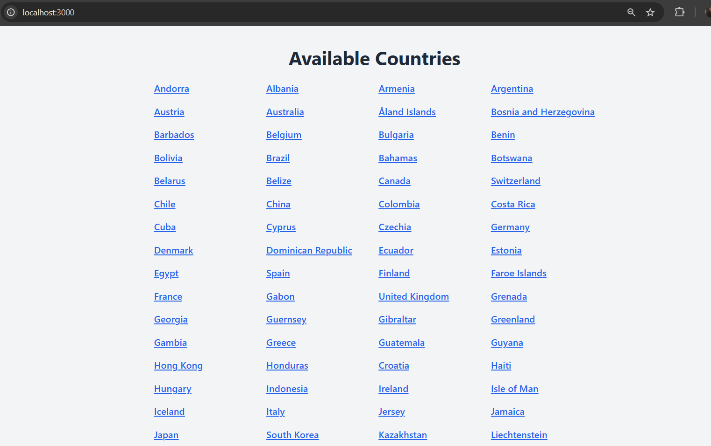
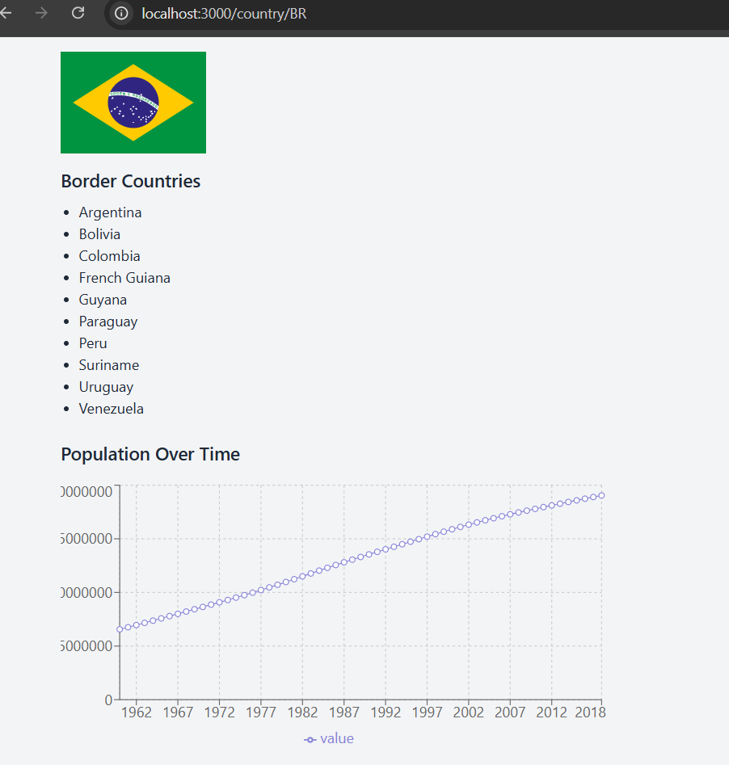

# Country Info App

This project is a **Full-Stack Application** built with a focus on providing detailed information about countries, including border countries, population data, and flags. It consists of a **backend** developed using Node.js and Express, and a **frontend** built with Next.js and React. Tailwind CSS is used for styling the frontend components.

## Table of Contents

- [Features](#features)
- [Technologies Used](#technologies-used)
- [Installation and Setup](#installation-and-setup)
  - [Backend](#backend-setup)
  - [Frontend](#frontend-setup)
- [Usage](#usage)
- [Screenshots](#screenshots)

## Features

- Retrieve a list of all countries.
- Display detailed information for each country:
  - Country flag.
  - Bordering countries with navigation links.
  - Population data displayed as a chart.
- Backend API for fetching country-specific data.
- Responsive UI using **Tailwind CSS**.

## Technologies Used

### Backend

- Node.js
- Express.js
- Axios
- ESlint and Prettier for code quality
- Nager.Date API (https://date.nager.at/swagger/index.html)
- Postman Country Info API (https://documenter.getpostman.com/view/1134062/T1LJjU52)

### Frontend

- Next.js
- React.js
- Tailwind CSS
- ESlint and Prettier for code quality
- TypeScript
- Recharts (for population data visualization)

## Installation and Setup

### Prerequisites

- Node.js (v18 or higher)
- pnpm package manager

- Clone repo

```bash
git clone https://github.com/gabriel-am12/country_info_app.git
```

### Backend Setup

1. Navigate to the backend directory:

```bash
cd backend
```

2. Install dependencies:

```bash
pnpm install
```

3. Setup `.env` file

```bash
PORT=3001 (for example, at your choice)
BASE_URL_NAGER=https://date.nager.at/api/v3
BASE_URL_COUNTRIES=https://countriesnow.space/api/v0.1
```

4. Start backend server

```bash
pnpm start
```

### Frontend Setup

1. Navigate to the frontend directory:

```bash
cd frontend
```

2. Install dependencies:

```bash
pnpm install
```

3. Setup `.env` file

```bash
NEXT_PUBLIC_BACKEND_URL=http://localhost:port_you_use_in_backend_env
```

4. Start frontend server

```bash
pnpm dev
```

## Usage

1. Start both the backend and frontend servers(in separated terminals for example).
2. Access the application in your browser at http://localhost:3000.
3. Explore the available countries and their details.

## Screenshots



